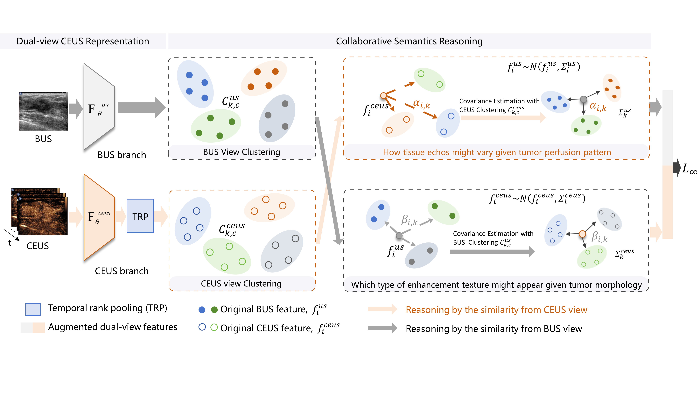

<div align="center">

# CRIDA

The official implementation for the paper: <br/> [_Image by Co-reasoning: A Collaborative Reasoning-based Implicit Data Augmentation method for Dual-view CEUS Classification_]().


<p align="center">
  
</p>

</div>

## Contents
- [Setup](#Setup)
  	- [Data preparation](#Data-preparation)
  	- [Install the environment](#Install-the-environment)
  	- [Set project paths](#Set-project-paths)
- [Training](#Training)
- [Evaluation](#Evaluation)
- [Visualization](#Visualization)


<details open>

<summary ><h2 style="display: inline">Setup</h2></summary>

### Data preparation
Put the datasets in ***${DATA_DIR}***. It should look like this:
   ```
   ${DATA_DIR}
     -- 0
         |-- class0_case0
             |-- dynamics
                 |-- 0.png
                 |-- 1.png
                 |-- ...
                 |-- x_p.png (peak)
                 |-- ...
                 |-- n.png
             |-- CEUS.png
             |-- US.png
         |-- class0_case1
         |-- ...
         |-- class0_casen
     -- 1
         |-- class1_case0
         |-- class1_case1
         |-- ...
         |-- class1_casen
     -- ...
   ```


### Install the environment

**Method1**: Use the Anaconda ***CUDA 12.0***
```shell
conda env create -f environment_cuda12.yaml
```

**Method2**: Use the pip ***CUDA 12.0***
```shell
pip install -r requirements_cuda12.txt
```

### Set project paths
To update the dataset configuration in [config.py](./config.py), you can define your custom dataset settings as shown below:

```python
'${YourDatasetName}': {
        'lambda0': 0.25,
        'sigma': 1,
        'us_dim': 512,
        'ceus_dim': 512,
        'num_clusters': 3,
        'num_class': ${YourDatasetClassNum},  # Number of classes in your dataset
        'train_type': 'tvt',  
        'dset_dir': ${DATA_DIR},  # Directory path for your dataset
        'data_type': 'image', 
        'epochs': 100,  # Number of training epochs
    }
```

</details>

<details open>

<summary ><h2 style="display: inline">Training</h2></summary>

```shell
python train.py
```

</details>


<details open>

<summary ><h2 style="display: inline">Evaluation</h2></summary>

```shell
python evaluate.py
```

</details>


<details open>

<summary ><h2 style="display: inline">Visualization</h2></summary>

```shell
python visual/visual_feature.py
```

</details>


